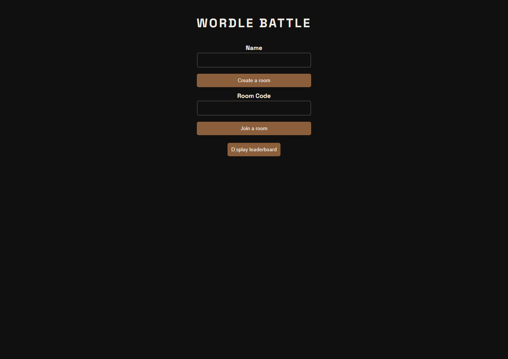
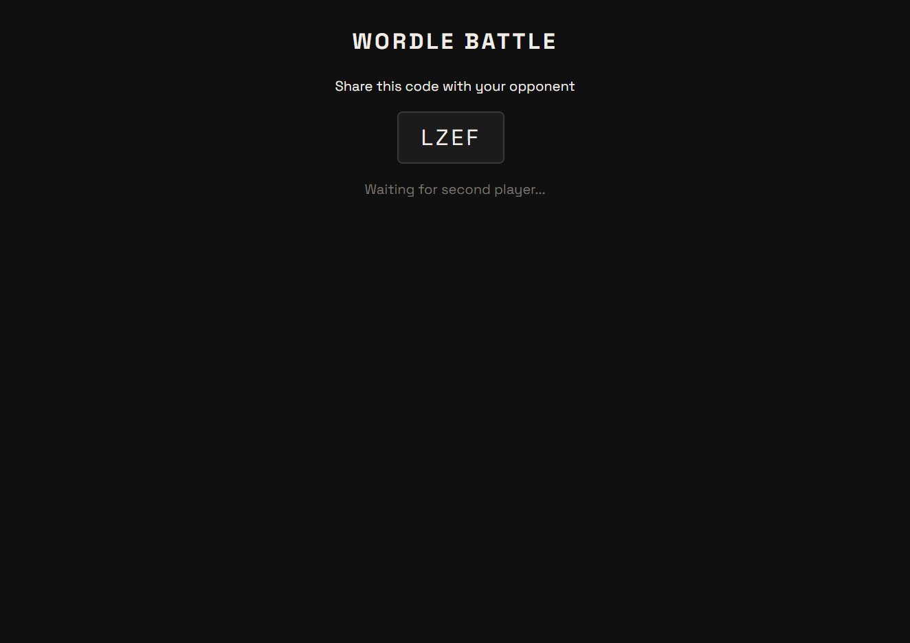
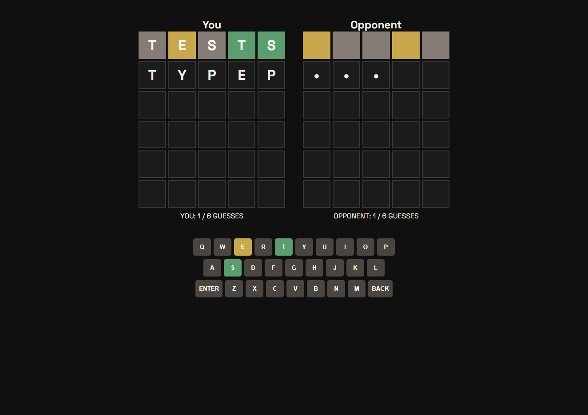
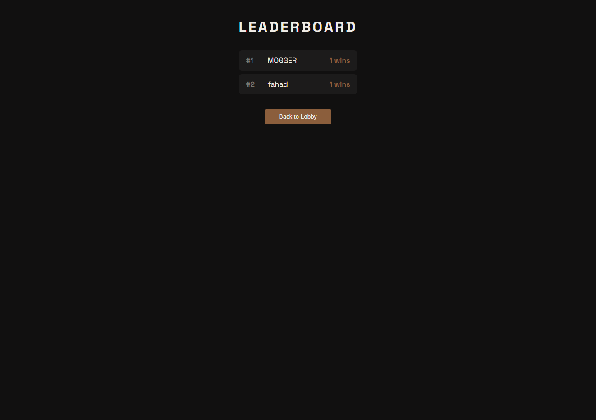
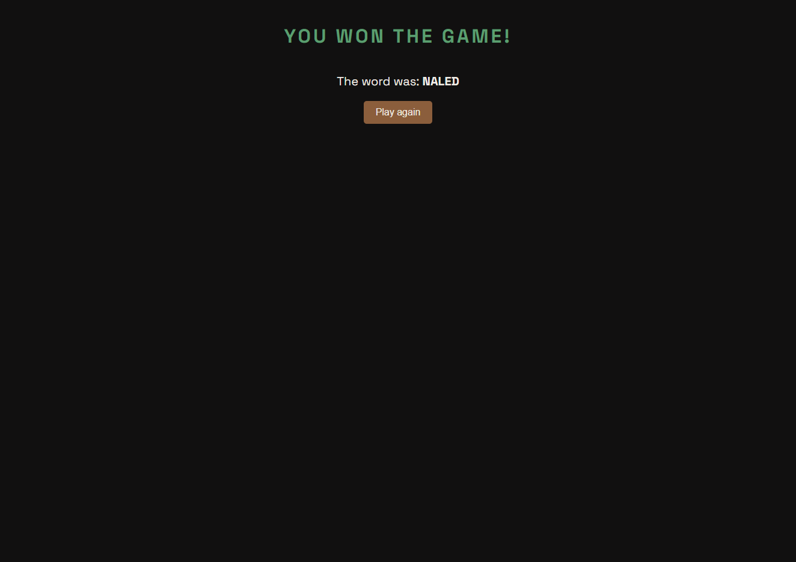

# Wordle Battle

A real-time 1v1 multiplayer Wordle game. Compete against a friend to guess the word first.

**Live Demo**: https://wordle-battle-sigma.vercel.app

## Screenshots







## Features

- Real-time multiplayer via Socket.io
- See your opponent's progress live as they guess
- Leaderboard tracking wins across matches
- Room code system, create a room and share the code
- Animated tiles with flip and shake effects

## Tech Stack

**Client**: React, TypeScript, Vite, Socket.io-client  
**Server**: Node.js, Express, TypeScript, Socket.io  
**Database**: PostgreSQL, Prisma  
**Deployment**: Vercel (client), Render (server + DB)

## Environment Variables

Create `server/.env`: DATABASE_URL=your_postgres_url, PORT=3001, CLIENT_URL=http://localhost:5173
Create `client/.env`: VITE_API_URL=http://localhost:3001

## Running Locally

```bash
# Clone the repo
git clone https://github.com/adqm0001/wordle-battle

# Install dependencies
cd wordle-battle
npm install
cd server && npm install
cd ../client && npm install

# Run server
cd server && npm run dev

# Run client
cd client && npm run dev
```